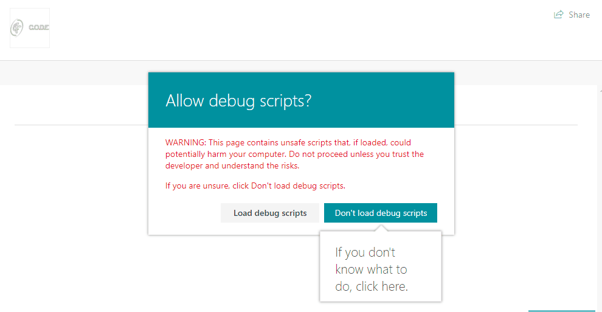
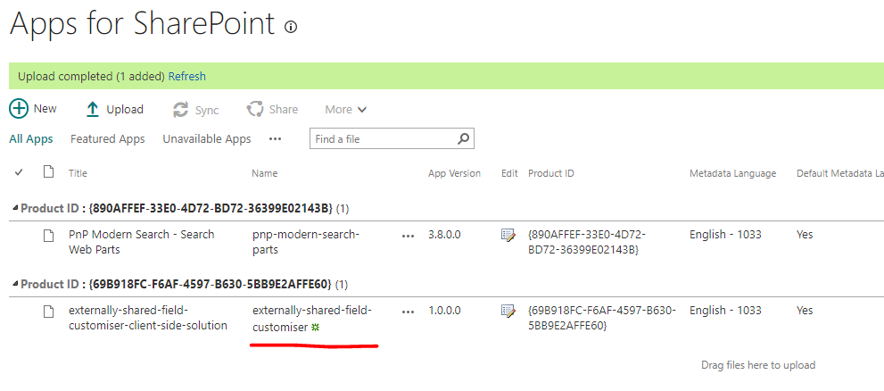

# spfx-IsExternallyShared
## SPFX Field Customiser
A SPFX Field Customiser to show if the item is externally shared 



## Deploy SPFX 
Run each line separate.
``` powershell
npm install
gulp build --ship
gulp bundle --ship
gulp package-solution --ship
```
Open the folder ./sharepoint/solution to get the file ./sharepoint/solution/externally-shared-field-customiser.sppkg

- Open your App Catalog
- Click on Apps For SharePoint
- Upload the externally-shared-field-customiser.sppkg to the list.
- Tick 'Make this solution available to all sites in the organization', click Deploy



## PNP-Template
The pnp-FieldTemplate.xml is a PNP template you can use to add the field to your site.

Navigate the the PNP-Template folder, then using Powershell with PNP-PowerShell
```powershell
Connect-PnPOnline -Url:'https://<yourtenant>.sharepoint.com/sites/DeveloperSite'
``` 
Sign in with your credentials

```powershell
Set-PnpTraceLog -On
Apply-PnPProvisioningTemplate -Path:'.\PnP-Template\pnp-FieldTemplate.xml' -Verbose
```

Once you have run the template, you can then add the column to any list manually.
- Go to List Settings
- Under Columns, select <b>Add from existing site columns</b>
- Change the group to <b>SPFX Columns</b>
- Select <b>Externally Shared</b> and click <b>Add</b>
- Tick option to <b>Add to default view</b>
- Click <b>Ok</b>

 (I'll leave it to you to programmatically add it to your chosen lists)
